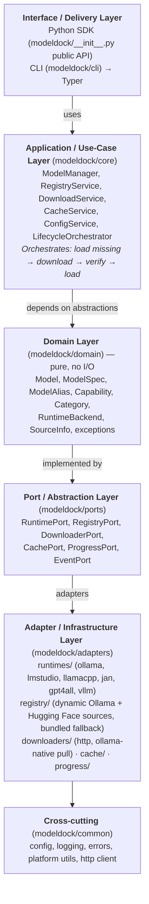
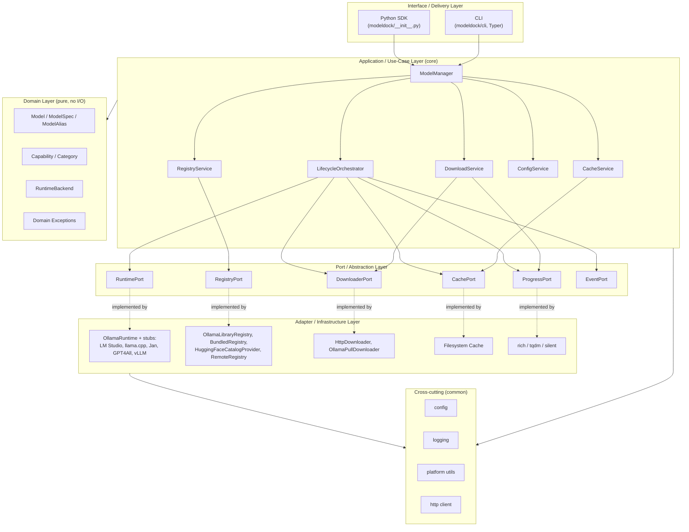

# ModelDock — Architecture

> Production-ready architecture for ModelDock, a lightweight, Python-first model
> management layer for local LLM runtimes. Designed as a "package manager for
> local AI models," starting with Ollama and extensible to LM Studio, llama.cpp,
> Jan AI, GPT4All, and vLLM.

This document is the authoritative architecture reference. It contains no
implementation code — only design, structure, responsibilities, and decisions.

---

## 1. Overall Architecture

ModelDock is a **management layer** that sits *above* local model runtimes. It
does not run inference itself; it orchestrates discovery, download, caching,
installation verification, and loading through pluggable runtime adapters.

**Layered (Clean Architecture) view — dependencies point inward:**



*The diagram below visualizes ModelDock's hexagonal architecture with clear dependency flow from outer layers toward the core domain.*



**Key principle:** Domain and ports know nothing about Ollama, HTTP, or the
filesystem. The application layer depends only on port *interfaces*. Concrete
runtimes/downloaders are injected (Dependency Inversion). This is what makes
adding LM Studio, vLLM, etc. a matter of writing one new adapter class — no
changes to core logic.

---

## 2. Package Structure

```
modeldock/
├── pyproject.toml                 # build, deps, entry point, tool config
├── README.md
├── LICENSE
├── Architecture.md                # this document
├── src/
│   └── modeldock/
│       ├── __init__.py            # public API surface (load, list, search, ...)
│       ├── __main__.py            # enables `python -m modeldock`
│       ├── domain/                # pure business entities + value objects
│       │   ├── __init__.py
│       │   ├── model.py           # Model, ModelSpec, ModelRef
│       │   ├── capability.py      # Capability enum (chat, embed, vision, ...)
│       │   ├── category.py        # Category enum (coding, chat, ...)
│       │   ├── alias.py           # alias resolution rules
│       │   ├── backend.py         # RuntimeBackend enum/registry
│       │   └── errors.py          # domain exceptions
│       ├── ports/                 # abstract interfaces (Protocols)
│       │   ├── runtime.py         # RuntimePort
│       │   ├── registry.py        # RegistryPort
│       │   ├── downloader.py      # DownloaderPort
│       │   ├── cache.py           # CachePort
│       │   ├── progress.py        # ProgressPort
│       │   └── events.py          # EventPort (hooks)
│       ├── core/                  # application services / use cases
│       │   ├── config.py          # ConfigService
│       │   ├── registry.py        # RegistryService (search, info, categories)
│       │   ├── download.py        # DownloadService (orchestrates pull)
│       │   ├── cache.py           # CacheService (smart caching)
│       │   ├── lifecycle.py       # LifecycleOrchestrator (load flow)
│       │   └── manager.py         # ModelManager (facade over services)
│       ├── adapters/              # infrastructure implementations
│       │   ├── runtimes/
│       │   │   ├── base.py        # BaseRuntime (shared logic)
│       │   │   ├── ollama.py      # OllamaRuntime (shipped)
│       │   │   ├── lmstudio.py    # stub/placeholder for future
│       │   │   ├── llamacpp.py
│       │   │   ├── jan.py
│       │   │   ├── gpt4all.py
│       │   │   └── vllm.py
│       │   ├── registry/
│       │   │   ├── ollama_library.py  # dynamic catalog from ollama.com (default)
│       │   │   ├── bundled.py        # static fallback catalog (offline)
│       │   │   └── remote.py         # optional remote registry fetch
│       │   ├── downloaders/
│       │   │   ├── http.py        # generic HTTP downloader
│       │   │   └── ollama_pull.py # delegates to `ollama pull`/API
│       │   ├── cache/
│       │   │   └── filesystem.py  # filesystem cache + manifest
│       │   └── progress/
│       │       ├── rich_progress.py
│       │       ├── tqdm_progress.py
│       │       └── silent.py
│       ├── cli/                   # command-line interface
│       │   ├── __init__.py
│       │   ├── app.py             # Typer app assembly
│       │   ├── commands/
│       │   │   ├── load.py
│       │   │   ├── install.py
│       │   │   ├── list.py
│       │   │   ├── search.py
│       │   │   ├── remove.py
│       │   │   ├── update.py
│       │   │   ├── info.py
│       │   │   └── cache.py
│       │   └── console.py         # shared output helpers
│       ├── common/                # cross-cutting utilities
│       │   ├── config.py          # settings model + loaders
│       │   ├── logging.py         # logging setup
│       │   ├── platform.py        # OS detection, paths
│       │   ├── http.py            # shared httpx client factory
│       │   └── errors.py          # base error hierarchy
│       └── data/
│           └── catalog.json       # bundled model registry data
└── tests/
    ├── unit/
    ├── integration/
    ├── e2e/
    ├── conftest.py
    └── fixtures/
```

Using `src/` layout avoids import-shadowing and is the modern Python packaging
standard.

---

## 3. Responsibility of Each Module

| Module | Responsibility |
|---|---|
| `domain/` | Pure entities (no I/O, no framework). `Model`, `ModelSpec`, `Capability`, `Category`, `ModelRef`, alias rules. Validates invariants. |
| `ports/` | `typing.Protocol` interfaces defining *what* the system needs from the outside world (runtime, registry, downloader, cache, progress, events). No implementation. |
| `core/` | Application services that implement use cases by composing ports. `LifecycleOrchestrator` is the brain behind `load()`. `ModelManager` is the high-level facade. |
| `adapters/runtimes/` | Concrete runtime integrations. Each implements `RuntimePort`. Ollama ships first; others are stubs implementing the interface. |
| `adapters/registry/` | Provides the searchable model catalog. `ollama_library.py` scrapes ollama.com for the full model list with auto-detected categories/capabilities; `bundled.py` is a static fallback; `remote.py` can refresh from a URL. |
| `adapters/downloaders/` | Moves bytes. `ollama_pull.py` wraps Ollama's native pull; `http.py` is a generic fallback for runtimes that expose direct URLs. |
| `adapters/cache/` | Tracks what is installed/downloaded so we never re-fetch. Filesystem manifest + content hashing. |
| `adapters/progress/` | Pluggable progress reporters (rich, tqdm, silent) implementing `ProgressPort`. |
| `cli/` | Thin delivery layer. Translates argv → core service calls. No business logic. |
| `common/` | Config loading, logging bootstrap, platform/OS helpers, shared HTTP client, base errors. |
| `data/catalog.json` | **Deprecated.** Static bundled model registry. Replaced by `OllamaLibraryRegistry` which scrapes ollama.com dynamically. Kept as offline fallback only. |

---

## 4. Runtime Abstraction Design

The heart of extensibility. Define one protocol (`RuntimePort`):

- `backend: RuntimeBackend` — identifies the runtime.
- `is_available() -> bool` — is the runtime installed/running?
- `list_installed() -> list[ModelRef]` — models present locally.
- `is_installed(ref: ModelRef) -> bool` — presence check.
- `pull(ref: ModelRef, progress: ProgressPort) -> PullResult` — download/install.
- `remove(ref: ModelRef) -> None` — uninstall.
- `get_model_client(ref: ModelRef) -> ModelClient` — returns a ready-to-use client.
- `default_tag_for(spec: ModelSpec) -> str` — resolve default variant.

- **`ModelClient`** is a narrow, runtime-agnostic wrapper returned by
  `get_model_client`. It exposes `chat()`, `embed()`, `generate()` — but
  ModelDock's primary job is *management*, so the client can be a thin
  pass-through to the runtime's own SDK (e.g., `ollama.Client`). This keeps
  ModelDock lightweight and avoids re-implementing inference.
- **`BaseRuntime`** in `adapters/runtimes/base.py` provides shared logic (alias
  resolution, availability caching, error normalization) so each concrete
  runtime only implements runtime-specific calls.
- **Runtime selection:** `ModelManager` picks a runtime via (a) explicit
  `backend=` arg, (b) config default, (c) auto-detection of which runtimes are
  installed. This is Open/Closed: new runtimes register themselves without
  touching the manager.
- **Registry of runtimes:** a `RuntimeRegistry` maps `RuntimeBackend` → factory.
  Discovered via entry points (see §14) or an internal registry dict.

---

## 5. Public Python API Design

Python-first, beginner-friendly, zero-config. Top-level functions delegate to a
singleton `ModelManager` (lazy-initialized, configurable).

```python
import modeldock as md

# Core: auto-install-if-missing then return a ready client
client = md.load("llama3")                 # alias → resolves spec
client = md.load("llama3:8b", backend="ollama")

# Discovery & management
md.list()                                  # all known models (catalog)
md.search("coding")                        # by name/capability/category
md.installed()                             # models present locally
md.info("qwen3")                           # metadata, sizes, capabilities
md.categories()                            # available categories
md.recommend(task="coding")                # guided selection

# Lifecycle
md.install("llama3")                       # explicit download
md.install_category("coding")              # bulk
md.update("llama3")                        # pull newer tag
md.remove("llama3")                        # uninstall
md.verify("llama3")                        # integrity check

# Cache
md.cache.status()
md.cache.clean()                           # remove orphaned/partial
md.cache.path()

# Advanced / explicit
mgr = md.Manager(backend="ollama", config=...)   # explicit instance
```

Design notes:

- `load()` is the flagship — implements the "missing → download → verify → load"
  flow from the problem statement.
- Returned `client` is runtime-native (e.g., `ollama.Client` wrapper) so users
  aren't locked into a ModelDock-specific inference API.
- All functions accept `backend=`, `progress=`, `config=` overrides for power
  users; defaults make them zero-config.

---

## 6. CLI Command Structure

Built on **Typer** (type-hint driven, modern, builds on Click). Entry point
`modeldock` → `python -m modeldock`.

```
modeldock load <model> [--backend ollama] [--tag 8b]
modeldock install <model>...
modeldock install-category <category>     # e.g. coding, vision
modeldock list                            # known catalog models
modeldock installed                       # locally installed
modeldock search <query>                  # name/capability/category
modeldock info <model>
modeldock recommend [--task coding]
modeldock update <model>...
modeldock remove <model>...
modeldock sources                         # list active model sources + status
modeldock sources refresh                 # force live sources to re-fetch
modeldock cache status
modeldock cache clean
modeldock cache path
modeldock config show
modeldock config set <key> <value>
modeldock --version
modeldock --help
```

- `search` is the discovery entry point: it queries the live sources for the
  active backend and shows each result's provenance (`Source` column) so users
  never need to know which source holds a model.
- `list` primarily surfaces the known catalog; `installed` is the locally
  present models.
- `sources` reports where discovered models come from (Ollama Official,
  Hugging Face, bundled fallback, plugins) and whether each source is
  currently populated — see §9. `sources refresh` bypasses the discovery-cache
  TTL for a live re-fetch.

- Each CLI command is a thin wrapper calling the same `core` services the Python
  API uses → single source of truth, DRY.
- Global options: `--backend`, `--config-path`, `--log-level`, `--no-progress`,
  `--yes` (skip prompts).

---

## 7. Configuration Management

- **Source precedence (low → high):** built-in defaults → bundled
  `catalog.json` → system config (`<sys-prefix>/etc/modeldock`) → user config
  (`~/.config/modeldock/config.toml` on Linux/macOS,
  `%APPDATA%\modeldock\config.toml` on Windows) → env vars (`MODELDOCK_*`) →
  explicit runtime overrides.
- **Format:** TOML for the file (human-friendly, stdlib `tomllib` in 3.11+).
- **Model:** a frozen `Settings` dataclass/pydantic model: `default_backend`,
  `cache_dir`, `registry_url`, `catalog_source`, `log_level`, `progress_style`,
  `auto_install`, `execution_policy`, `ollama_host`, etc.
- **Cross-platform paths:** resolved via `common/platform.py` using
  `platformdirs` (the de-facto standard for user/config/cache dirs across OSes).
- **Validation:** config loaded through a validator; unknown keys warn, invalid
  values fall back to defaults with a logged warning (never crash on bad config).
- **Execution policy:** `execution_policy` (`unrestricted` | `warn` | `strict`)
  is the one restricted-execution knob. It is applied in `core/execution.py`
  (`ExecutionGuard`), which both `LifecycleOrchestrator.load` and
  `ModelManager.run` consult, and which gates entry-point plugin discovery in
  `RuntimeRegistry`/`CatalogProviderRegistry`. Adapters never implement it.
  See SECURITY.md, "Model Execution & Native Code".

---

## 8. Cache Management

Goal: "never re-download installed models" + offline cache management.

- **Two distinct concepts:**
  1. **Installed-model cache** — tracks models already pulled into the runtime
     (Ollama's store). Verified via `runtime.list_installed()` + a local
     manifest mapping `ModelRef → installed_tag + sha`.
  2. **Download artifact cache** — for runtimes that download raw files
     (llama.cpp GGUF, GPT4All), a content-addressed store
     (`cache/<sha256[:16]>/model.gguf`) so re-installs are instant offline.
- **Manifest:** `cache/manifest.json` (or per-backend) recording
  `ref, tag, size, sha256, pulled_at, source`.
- **Smart caching logic:** `CacheService.is_fresh(ref)` compares requested
  tag/spec against manifest + runtime state. `cache.clean()` removes partial
  downloads and orphaned artifacts not referenced by any installed model.
- **Content hashing** (SHA-256) makes the cache path-independent and
  self-validating — aligns with the content-hash-cache pattern.
- **Offline mode:** if `auto_install` is off or network unavailable, `load()`
  fails fast with a clear "model not installed and offline" message rather than
  hanging.

---

## 9. Model Registry / Source Architecture

A **searchable, versioned catalog** decoupled from any runtime.

**Core principle — dynamic discovery is the source of truth; there is no
hand-maintained catalog.** A `RegistryPort` implementation *is* a ModelDock
**model source**: it answers "what models exist" from an external source of
truth (ollama.com, the Hugging Face Hub, a plugin), not from a file someone
edits. Adding a model that a supported source already exposes requires **zero
ModelDock code changes** — no `catalog.json` edit, no `ModelSpec(...)`, no
manual registration. When Ollama publishes `new-model`, `OllamaLibraryRegistry`
discovers it on the next fetch; a new GGUF repo appears via the Hugging Face
Hub API. `data/catalog.json` is an emergency offline fallback only (§below),
never the primary source.

**Provenance.** Every source stamps a human-facing label onto the specs it
emits (`ModelSpec.source`, e.g. `"Ollama Official"`, `"Hugging Face"`,
`"Bundled (offline fallback)"`; see `domain/source.py`). Discovery results and
`info` carry this label so users always see where a model came from, and
`modeldock sources` enumerates the active sources with a trust level
(official / verified / community / bundled / custom), live-vs-static kind, and
current model count. This is the observability/trust requirement made concrete.

- **Dynamic catalog** (`adapters/registry/ollama_library.py`): scrapes
  `ollama.com/library` for the full model list. Auto-detects `Category` and
  `Capability` from model names and HTML tags. Caches results locally
  (`<cache_dir>/catalog_cache.json`) with 24-hour TTL for offline use.
  This is the **default** registry.
- **Bundled fallback** (`data/catalog.json`): static curated entries with
  `name, aliases[], category, capabilities[], default_tag,
  variants[{tag, params, size_bytes, min_ram}], description, backend_hints`.
  Used as offline fallback when `catalog_source="bundled"` or when the
  dynamic catalog fails and no cache exists.
- **`RegistryPort`** abstraction (the model-source interface): `search(query)`,
  `get(ref)`, `resolve(ref)` (friendly name → canonical identity; an explicit
  alias of `get`), `versions(ref)` (known version tags for a model),
  `by_category(cat)`, `recommend(task)`, `list_all()`. Concrete sources also
  expose `describe() -> list[SourceInfo]` (self-description for `modeldock
  sources`) and, for live sources, `refresh()` (force a re-fetch, bypassing the
  discovery-cache TTL). `SourceInfo` (`domain/source.py`) is pure data —
  name, trust, live/static, backend, model count, cache path.
- **`CachedCatalogRegistry`** (`adapters/registry/base.py`): the shared
  fetch → cache → index pipeline behind every live catalog source.
  Subclasses implement only `_fetch_from_network()` (reach the source, parse
  raw entries) and `_to_spec()` (raw entry → `ModelSpec`); disk caching
  (`common/catalog_cache.py`, TTL'd JSON with atomic writes), indexing, and
  every `RegistryPort` method are implemented once here so a new live source
  (Hugging Face, LM Studio, ...) never has to reimplement them.
  `CatalogProvider` (`ports/catalog_provider.py`) documents the matching
  fetch/parse contract for such sources.
- **Implementations:**
  - `OllamaLibraryRegistry` — scrapes ollama.com, auto-detects metadata,
    caches locally (default). Built on `CachedCatalogRegistry`.
  - `HuggingFaceCatalogProvider` (`adapters/registry/huggingface_catalog.py`)
    — queries the Hugging Face Hub API (`filter=gguf`) live for GGUF-format
    models, cached 24h. Neither LM Studio nor llama.cpp expose an online
    catalog of their own — both consume GGUF repos directly from the Hub — so
    `LMStudioRuntime`/`LlamaCppRuntime.models_for_category`/
    `models_for_capability` construct one instance each (tagging results with
    their own `RuntimeBackend`) and share the same on-disk cache, since it's
    the same underlying GGUF universe either way. LM Studio falls back to a
    small curated table (`adapters/runtimes/lmstudio_catalog.py`) when the Hub
    is unreachable and no cache exists yet; llama.cpp, which has no catalog of
    its own at all, returns an empty list in that case rather than the
    shared Ollama-tag catalog's invalid names.
  - `BundledRegistry` — reads `catalog.json` (offline fallback).
  - `RemoteRegistry` (`adapters/registry/remote.py`) — optional fetch of a
    `catalog.json`-shaped document from `registry_url`, for community updates
    without a package release. Built on `CachedCatalogRegistry`, but
    cache-*first*: the disk cache (`<cache_dir>/remote_catalog_cache.json`,
    1-hour TTL) answers on its own inside the TTL so a configured URL costs no
    round-trip per CLI invocation; `refresh()` bypasses it, and once a live
    fetch fails an expired cache is still preferred over none. The remote
    entries are merged *over* the bundled catalog rather than replacing it —
    a remote entry wins a name collision, but no bundled model is ever
    dropped, so a remote URL can only add to discovery. Non-`http(s)` URLs are
    rejected up front, the response body is size-capped, and a single
    malformed entry is skipped rather than discarding the whole payload.
  - `CompositeRegistry` (`adapters/registry/composite.py`) — merges an
    ordered list of `RegistryPort` sources into one: `search`/`list_all`/
    `by_category`/`recommend` union every source's results (earlier source
    wins on a name collision), and `get()` returns the first source that
    resolves the reference. Used so general discovery surfaces models the
    *active* backend can actually install, not just the Ollama-named shared
    catalog.
- **Configuration:** `catalog_source` setting in `Settings` controls which
  registry is used: `"ollama"` (dynamic only) and `"bundled"` (static only)
  are explicit single-source opt-outs with no network beyond that one source.
  `"remote"` selects `RemoteRegistry` alone (still merged over bundled, inside
  the registry itself) and requires `registry_url`. Setting `registry_url`
  under `"auto"` instead merges the remote catalog in ahead of every other
  source, so entries published since the last release outrank the shipped
  ones; an unusable URL degrades to a warning rather than breaking discovery.
  `"auto"` (default) tries dynamic Ollama, falls back to bundled, **and**
  merges in the active backend's own live catalog when it has one —
  `ModelManager._resolve_backend_catalog` resolves it through
  `CatalogProviderRegistry` (built-in `HuggingFaceCatalogProvider` for LM
  Studio/llama.cpp, or a third-party plugin — see §14), wrapped together with
  the general catalog in a `CompositeRegistry`. Backends without a catalog of
  their own (Ollama) are unaffected — no composite is built, exactly as
  before.
- **Alias resolution:** `domain/alias.py` maps friendly names (`llama3`) →
  canonical `ModelSpec`. Handles version shortcuts (`llama3:8b`),
  capability-based lookup (`recommend("vision")`), and "auto model selection."
- **Auto-detection rules:**
  - **Category:** name contains `embed` → EMBEDDING; `code` → CODING;
    `vision`/`llava` → VISION; `r1`/`thinking` → REASONING; default → CHAT.
  - **Capabilities:** HTML pills (`tools`, `vision`, `thinking`, `audio`,
    `embedding`) map to `Capability` enum values. Default: CHAT + COMPLETION.

---

## 10. Downloader Architecture

`DownloaderPort`: `download(spec, dest, progress) -> Path` and
`pull(ref, progress) -> Result`.

- **Ollama path:** `OllamaPullDownloader` delegates to Ollama's native pull (CLI
  or `/api/pull` HTTP). Ollama manages its own blob store; ModelDock just tracks
  progress + verifies via `list_installed`.
- **Generic HTTP path:** `HttpDownloader` for runtimes exposing direct file URLs
  (llama.cpp GGUF, GPT4All). Uses `httpx` with streaming + resumable ranges,
  reporting bytes via `ProgressPort`.
- **Resumability:** HTTP downloader supports `Range` headers so interrupted
  downloads resume (critical for multi-GB models).
- **Progress:** downloaders emit progress events; `ProgressPort` renders them
  (rich/tqdm/silent).
- **Concurrency:** downloads are sequential by default but the service layer
  allows a `max_parallel` for `install_category` (each download isolated;
  respects disk/network).

---

## 11. Error Handling Strategy

- **Hierarchy** rooted at `ModelDockError` (in `common/errors.py`):
  - `RuntimeUnavailableError` (runtime not installed/running)
  - `ModelNotFoundError` (not in registry)
  - `ModelNotInstalledError` (missing locally, with `auto_install` hint)
  - `DownloadError` (network, checksum mismatch, interrupted)
  - `CacheError` (corrupt manifest, permission denied)
  - `ConfigError` (invalid setting)
  - `AliasResolutionError`
- **Fail-fast, clear messages:** every error carries actionable context
  (e.g., "Model 'llama3' not installed. Run `modeldock install llama3` or set
  `auto_install=True`.").
- **No silent swallowing.** Expected failure paths (model missing) raise typed
  errors the API/CLI can catch and present nicely.
- **Checksum verification:** downloads validated against expected SHA-256;
  mismatch → `DownloadError` with retry suggestion (never install corrupt
  weights).
- **Retry policy:** transient network errors retried with exponential backoff
  (configurable), then surface a clean error.
- **CLI mapping:** typed errors → friendly stderr messages + non-zero exit
  codes; `--debug` reveals full tracebacks.

---

## 12. Logging Strategy

- **Library-friendly:** never calls `logging.basicConfig()` at import (respects
  host app's config). Uses a named logger `modeldock.*`.
- **Bootstrap:** `common/logging.py` `configure_logging(level, fmt, handler)`
  called explicitly by CLI/entry points, not by imported library code.
- **Levels:** `ERROR` default for library use; CLI sets `INFO`/`DEBUG` via
  `--log-level` / config.
- **Structured option:** support JSON logs via `logging` `Formatter` for
  automation/CI; human-readable default.
- **Progress vs logs:** download progress goes through `ProgressPort` (not
  logging) to avoid log spam; substantive events (installed, verified, failed)
  go to logs.
- **Sensitive data:** never log model contents, tokens, or secrets; only
  metadata (names, sizes, statuses).
- **CLI boundary (hard rule):** the CLI is the *only* place that resolves and
  validates user-supplied options. Typer option descriptors (e.g. `OptionInfo`)
  and other framework objects **must never cross into `common/`**. The CLI
  callback must coerce/validate every option to a plain value (string/int/bool)
  *before* calling `configure_logging()` or any `common.*` function. As a
  defensive backstop, `configure_logging()` itself normalizes the `level`
  argument: a non-string or unrecognized level falls back to `INFO` rather than
  crashing. This keeps `common/` free of CLI-framework coupling and makes the
  logging bootstrap robust to direct/test invocation.

---

## 13. Testing Strategy

- **Unit** (`tests/unit`): domain logic (alias resolution, capability matching,
  config validation), pure functions, port contracts. Fast, no network, no
  runtime. Use `pytest` + `pytest-cov` (target ≥80%).
- **Adapter/port contract tests:** a shared test suite parameterized over every
  `RuntimePort`/`DownloaderPort` implementation to guarantee each adapter honors
  the interface (the "port contract" pattern). New runtimes must pass it.
- **Integration** (`tests/integration`): against a real or containerized Ollama
  when available; marked `@pytest.mark.integration` and skipped if runtime
  absent.
- **E2E** (`tests/e2e`): CLI invocation via `CliRunner` / `subprocess`,
  asserting exit codes and output.
- **Fixtures:** fake `RuntimePort`/`RegistryPort`/`CachePort` implementations
  (`tests/conftest.py`) so core logic is testable without Ollama installed —
  high testability by design (DI pays off here).
- **Cross-platform CI:** GitHub Actions matrix on Windows/macOS/Linux,
  Python 3.9–3.12.
- **Static quality:** `ruff` (lint+format), `mypy` (strict typing), `bandit`
  (security). Pre-commit hooks.

---

## 14. Extension / Plugin Strategy for Future Runtimes

Two complementary mechanisms:

1. **Entry-point discovery (preferred for third parties):** `pyproject.toml`
   declares
   ```
   [project.entry-points."modeldock.runtimes"]
   ollama = "modeldock.adapters.runtimes.ollama:OllamaRuntime"
   ```
   `RuntimeRegistry` scans
   `importlib.metadata.entry_points(group="modeldock.runtimes")` at startup. A
   *separate PyPI package* (`modeldock-vllm`) can ship a new runtime with zero
   changes to core. This is the Open/Closed principle in practice.

2. **Built-in registry (for first-party runtimes):** LM Studio, llama.cpp, Jan,
   GPT4All, vLLM ship as adapters in-repo, registered in an internal dict. Stubs
   implement `RuntimePort` from day one so the contract is enforced even before
   full implementation.

3. **Plugin hooks (`EventPort`):** lifecycle events (`before_pull`,
   `after_install`, `on_error`) allow user-supplied callbacks/plugins (e.g.,
   notify on download complete, custom verification).

4. **Model-source plugins:** live catalog sources use the identical
   entry-point pattern as runtimes, via `CatalogProviderRegistry`
   (`adapters/registry/catalog_registry.py`). The preferred group name is
   `modeldock.model_sources` (a source *is* a model source); the original
   `modeldock.catalog_providers` name is still scanned for backward
   compatibility, so existing plugins keep working:
   ```
   [project.entry-points."modeldock.model_sources"]
   vllm = "modeldock_vllm.catalog:build_catalog"
   ```
   The entry point resolves to a callable `(cache_dir: Path) -> RegistryPort`
   — a plain function or a one-argument class constructor. `ModelManager`
   resolves the active backend's own live catalog through this registry
   (`_resolve_backend_catalog`) and merges it into general discovery via
   `CompositeRegistry`, so `modeldock-vllm` can add live model discovery for
   vLLM with zero changes to core, exactly like adding a new runtime. Entry
   points take priority over built-ins (Hugging Face for LM Studio/llama.cpp),
   so a plugin can also replace a shipped catalog source. `RemoteRegistry`
   (a single arbitrary URL/JSON source) remains available as a simpler,
   non-plugin option for community catalog updates without a package release.

This means adding vLLM later = write one adapter class + one entry-point line
(plus, optionally, one catalog-provider entry-point line for live discovery).
Core, CLI, API, and tests are untouched.

---

## 15. Suggested Dependencies (with reasons)

| Dependency | Reason |
|---|---|
| `typer` | Modern CLI framework, type-hint driven, builds on Click; minimal boilerplate. |
| `httpx` | Async-capable, streaming + resumable downloads, connection pooling; better than `requests` for progress + ranges. |
| `pydantic` (v2) | Validate config, model specs, registry entries; great DX, serialization to/from JSON. |
| `platformdirs` | Correct cross-platform user/config/cache paths (Windows/macOS/Linux). |
| `rich` | Beautiful progress bars, tables for `list`/`info`; optional, lazy-imported. |
| `tqdm` | Lightweight progress alternative for headless/CI. |
| `tomli` / `tomllib` | TOML config parsing (stdlib `tomllib` 3.11+; `tomli` backport for 3.9–3.10). |
| `packaging` | Version comparison for update management. |
| Dev: `pytest`, `pytest-cov`, `pytest-mock`, `ruff`, `mypy`, `bandit`, `pre-commit` | Quality + testing. |

**Deliberately avoided:** heavy ML frameworks (torch, transformers) — ModelDock
is a *manager*, not an inference engine. Keeps it lightweight and
dependency-light. Runtime-native SDKs (e.g., `ollama` Python client) are
*optional* extras installed only when that backend is used
(`extras = {"ollama": ["ollama"]}`).

---

## 16. Design Decisions and Trade-offs

| Decision | Rationale | Trade-off |
|---|---|---|
| Clean Architecture + ports | Maximum extensibility for 6 future runtimes; testable without Ollama | More files/abstraction upfront; slight "ceremony" for a small v1 |
| Return runtime-native client from `load()` | Stay lightweight; don't reimplement inference | Less uniform cross-runtime inference API (acceptable — management is the product) |
| Dynamic catalog via HTML scraping | Always up-to-date with ollama.com; zero manual maintenance | Depends on ollama.com HTML structure; mitigated by 24h cache + bundled fallback |
| Entry-point plugins | Third parties extend without forking | Slightly more discovery code; stdlib `importlib.metadata` is cheap |
| `httpx` over `requests` | Streaming/resumable downloads, async-ready | Extra dep (small, well-maintained) |
| Optional runtime SDK extras | Tiny base install | User may need `pip install modeldock[ollama]` (documented) |
| Content-hash cache | Self-validating, offline-safe | Hash computation cost on large files (mitigated: hash streaming during download) |
| `load()` auto-install default off behind `auto_install` flag | Safety; no surprise network use | Slightly less "magic" out of the box (configurable) |

---

## 17. Future Scalability Considerations

- **New runtimes:** entry-point adapters — zero core changes (§14).
- **New models:** dynamic catalog scrapes ollama.com automatically; no manual
  catalog edits needed. Models appear as soon as they're added to ollama.com.
- **Concurrency:** `install_category` parallel downloads; service layer already
  async-ready (`httpx` async). Could add `asyncio` variants of the API
  (`md.aload(...)`) later without breaking sync API.
- **Remote/cloud registries & model hubs:** `RemoteRegistry` + `HttpDownloader`
  already support pulling from arbitrary URLs; a "model hub" backend is just
  another `RuntimePort`.
- **Versioning & updates:** `packaging` + manifest enables semantic version
  tracking, rollback, and `update --all`.
- **Multi-runtime orchestration:** `ModelManager` can route by capability
  (e.g., vision → Jan, coding → Ollama) via a capability→backend policy — the
  abstraction already supports it.
- **Distribution:** pure-Python, `src/` layout, minimal deps → trivially
  pip-installable, embeddable in apps, usable in serverless/CI.
- **Telemetry/analytics (opt-in):** `EventPort` hooks make an opt-in usage
  reporter trivial without coupling.
- **API stability:** public surface (`modeldock/__init__.py`) is narrow and
  stable; internals (`core`, `adapters`) can evolve freely behind ports.

---

*This document is the design contract for ModelDock. Implementation should
follow the structure, responsibilities, and port interfaces defined here.*